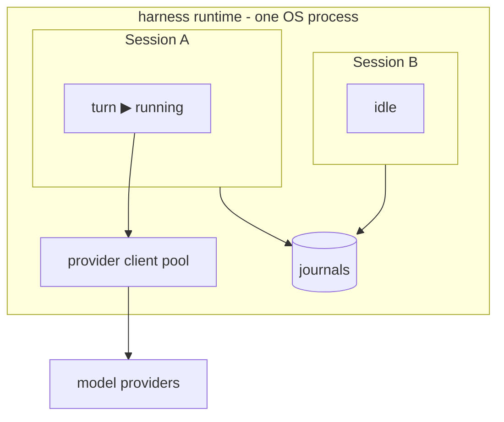
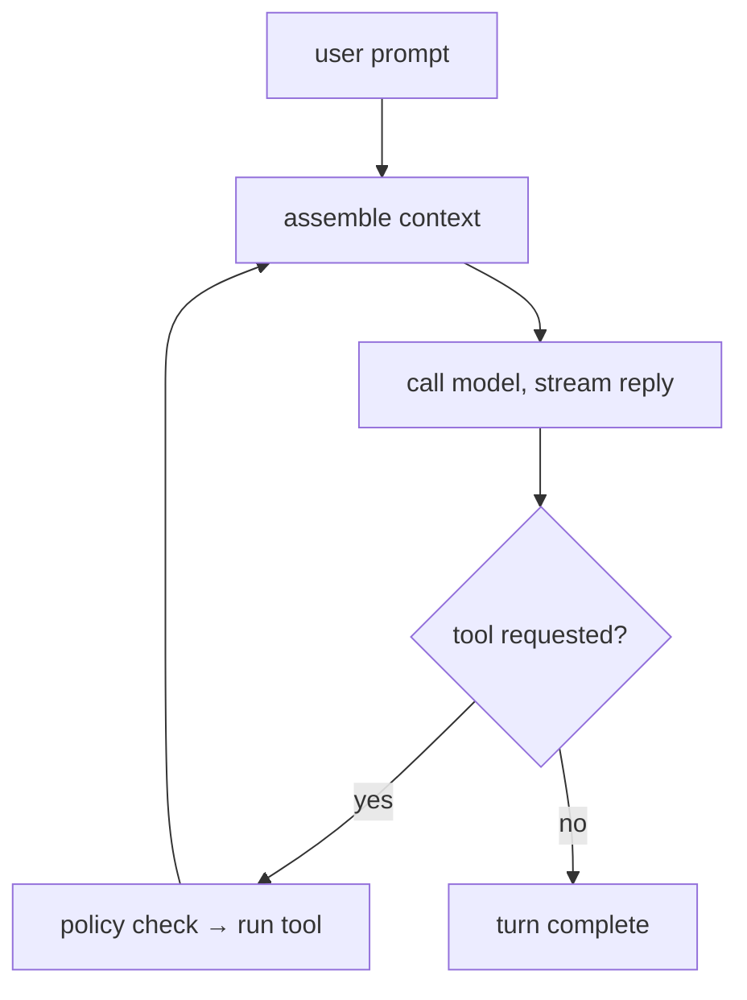
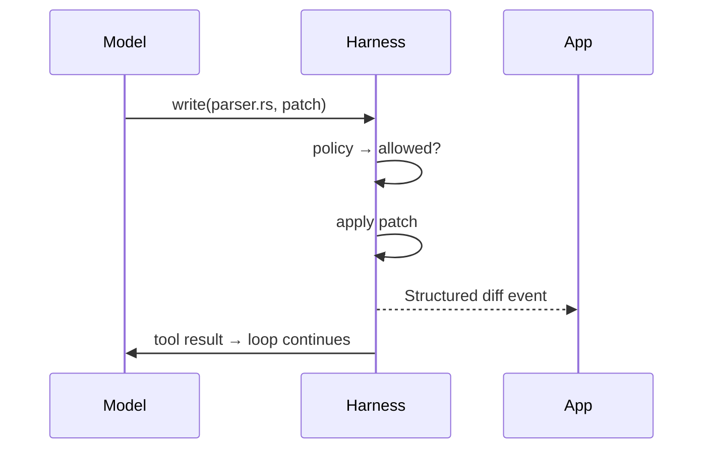

# `ag-harness` - a light LLM harness

`ag-harness` is the base layer between an application and an LLM. Rust-native,
app-facing and lightweight. It provides just the essentials: an agent loop, three core
tools, session management, and a typed event stream, leaving the actual product
decisions entirely to your app.

## Core features

- **Three built-in tools** - `read`, `write`, `bash`.
- **Structured edits** - the `write` tool applies git-style diff patches and emits
  clean, targeted diffs.
- **Permission policy** - every tool call passes a policy check.
- **Persisted sessions**

## Architecture

### Crates

```
agentty/
├── crates/
│   ├── ag-harness            # facade
│   ├── ag-harness-protocol   # Op, Event, Diff, Usage
│   ├── ag-harness-core       # loop, tools, sessions, context, journal
```

### Process model



## Agent loop

A turn loops until the model responds without requesting a tool:



### One tool call



## Editing

- **Write** - the model produces a git diff patch; the harness applies it. Alternative
  edit methods (exact-match string replacement, etc.) are future experiments.
- **Diff** - applied changes are streamed back as structured file-diff events,
  renderable directly as git diffs.
- **Output caps** - oversized tool output is truncated head+tail with a marker, so one
  careless command can't flood the session's context. Per-tool limits; `read` supports
  line ranges for precise re-reads.

## Context

- **Project discovery** - finds the project root and `AGENTS.md`; the model explores the
  rest via `bash`.
- **Base prompt** - one minimal system prompt.

## Permissions

All tools are denied by default. The session policy explicitly allows tools and, for
`bash`, the permitted commands:

```rust
Policy {
    read: Allow,
    write: Deny,
    bash: AllowCommands(["cargo test", "git status", "rg *"]),
}
```

## Library API

Example:

```rust
use ag_harness::{Harness, HarnessConfig, SessionConfig, ModelConfig, Policy, Event};

let harness = Harness::new(HarnessConfig {
    journal_dir: "~/.agentty/harness/sessions".into(),
    ..Default::default()
})?;

let session = harness.create_session(SessionConfig {
    cwd: "/home/andrei/proj".into(),
    model: ModelConfig::anthropic("claude-sonnet-4-6"),
    policy: Policy::all_tools(),
    ..Default::default()
}).await?;

let mut turn = session.prompt("make the failing test in src/parser.rs pass").await?;

while let Some(event) = turn.next().await {
    match event {
        Event::TextDelta(chunk)  => ui.append(chunk),
        Event::FileDiff(diff)    => ui.render_hunks(diff),
        Event::TurnComplete(usage) => println!("{} tokens", usage.total),
        Event::TurnFailed(err)   => eprintln!("{err}"),
        _ => {}
    }
}

let session = harness.resume_session(id).await?;       // rebuilt from the journal
```

## Differences from existing harnesses

- **User-facing products** (Claude Code, OpenCode, Aider): format output for humans;
  `ag-harness` emits events for apps.
- **Minimal harnesses** ([Pi](https://pi.dev/)): TypeScript-first, no permission layer;
  `ag-harness` is Rust-native with an enforced policy hook.
- **Vendor SDKs**: vendor-locked; `ag-harness` is model-agnostic.
- **Rust model-API crates** (`rig`): abstract the model call only; `ag-harness` adds the
  loop, persisted sessions, tools, permissions.
- **Heavy harnesses**: bundle orchestration; `ag-harness` leaves it to the app.

## Roadmap

1. **v1 - library.** `ag-harness` - unified crate integrated into agentty.
1. **Service wrapper.** `ag-harness-service` (JSON-RPC 2.0 over Unix socket, WebSocket
   for remote) + `ag-harness-client`.
