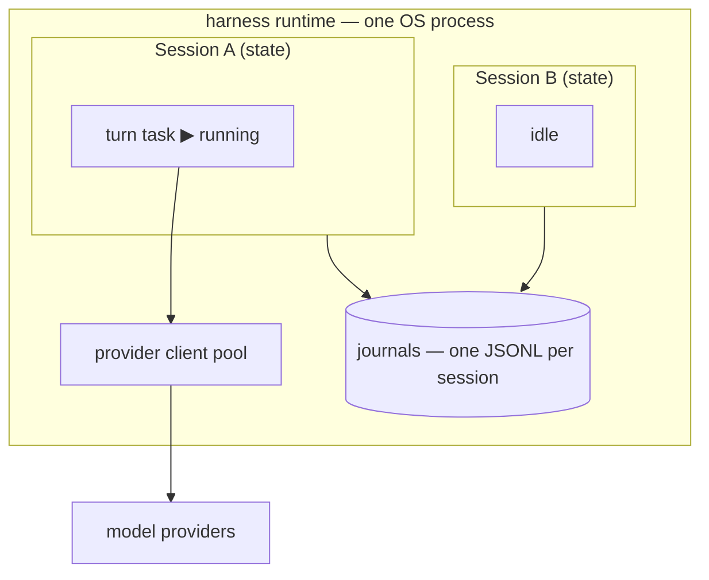
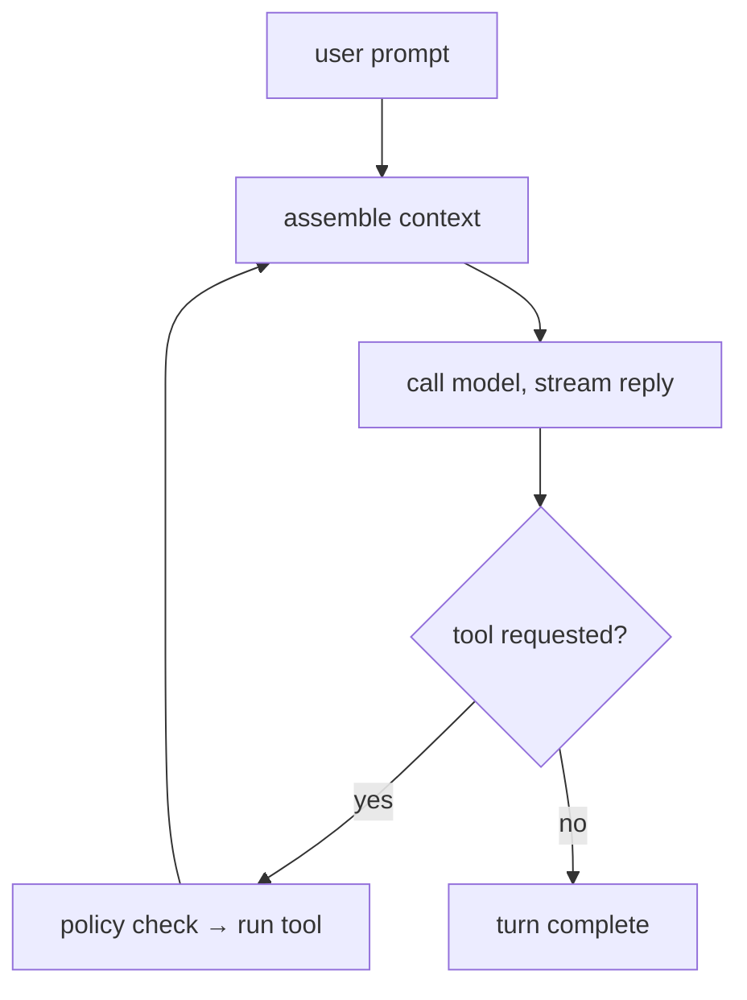
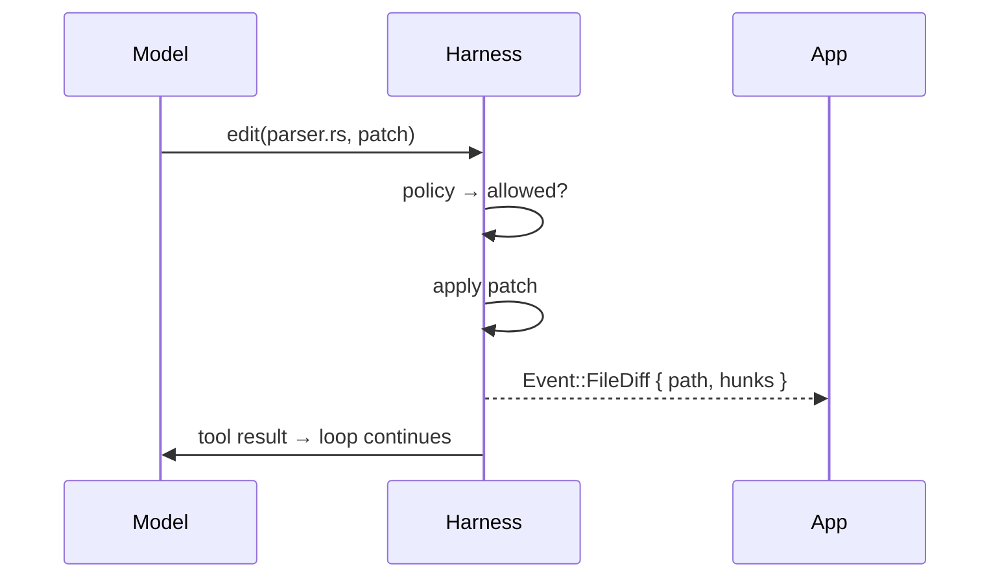

# `ag-harness` — a light LLM harness with a minimal tool set

`ag-harness` is the base layer between an application and an LLM. Rust-native,
app-facing and lightweight. It provides just the essentials: an agent loop, four core
tools, session management, and a typed event stream, leaving the actual product
decisions entirely to your app. The harness itself never renders UI, prompts humans, or
dictates orchestration.

First consumer: [agentty](https://github.com/agentty-xyz/agentty), which embeds the
harness as a crate.

## Core features

- **Four built-in tools** — `read`, `write`, `edit`, `bash`.
- **Structured edits** — the `edit` tool applies git-style diff patches and emits clean,
  targeted diffs, never rewritten files.
- **Permission policy** — every tool call passes a policy check.
- **Sessions with a journal** — each session is backed by an append-only JSONL file
  recording every message, tool call, and diff. The journal is the source of truth: it
  makes disconnect-and-reattach, replay, and crash recovery possible.
- **Cache-aware context** — a persistent prompt prefix to hit the provider's prompt
  cache.
- **Context optimization** — keeps long histories within the model's context window.
- **Typed event stream** — apps consume one stream of typed events: text deltas, diffs,
  turn completion.

## Non-goals

- No orchestration: no subagents, planners, or task queues.
- No sandboxing in core — isolation is the environment's job (container, VM).
- No UI.

## Architecture

### Crates

```
agentty/
├── crates/
│   ├── ag-harness-protocol   # Op, Event, Diff, Usage — serde types, no logic
│   ├── ag-harness-core       # loop, tools, sessions, context, journal (all logic)
│   ├── ag-harness-service    # later: bin, JSON-RPC 2.0 over UDS / WebSocket
│   └── ag-harness-client     # later: Rust client for the service
```

### Process model: one process, sessions as state, turns as tasks

- A **session** is a data structure: history, working directory, model config, policy.
- A **turn** is an async task running one prompt-to-completion cycle.



### The journal

A JSONL file per session that stores the session state:

```
~/.agentty/harness/sessions/<id>.jsonl
──────────────────────────────────────
{"seq":1,"type":"session_created","cwd":"/proj","model":"claude-sonnet-4-6"}
{"seq":2,"type":"user_message","text":"fix the failing test"}
{"seq":3,"type":"assistant_delta","text":"Looking at the test..."}
{"seq":4,"type":"tool_call","tool":"read","path":"src/parser.rs"}
{"seq":5,"type":"file_diff","path":"src/parser.rs","hunks":[...]}
{"seq":6,"type":"turn_complete","tokens":{"in":8210,"out":640}}
```

## Agent loop

A turn loops until the model responds without requesting a tool:



### One tool call



## Editing

- **Edit** — the model produces a git diff patch; the harness applies it. Alternative
  edit methods (exact-match string replacement, etc.) are future experiments.
- **Diff** — applied changes are streamed back as structured hunks
  (`Event::FileDiff { path, hunks }`), renderable as a git diff.
- **Output caps** — oversized tool output is truncated head+tail with a marker, so one
  careless command can't flood the session's context. Per-tool limits; `read` supports
  line ranges for precise re-reads.

## Context

- **Project discovery** — finds the project root and `AGENTS.md`; the model explores the
  rest via `bash`.
- **Base prompt** — one minimal system prompt.

## Permissions

All tools are denied by default. The session policy explicitly allows tools and, for
`bash`, the permitted commands:

```rust
Policy {
    read: Allow,
    edit: Allow,
    write: Deny,
    bash: AllowCommands(["cargo test", "git status", "rg *"]),
}
```

| Decision | Behavior                                                      |
| -------- | ------------------------------------------------------------- |
| `Allow`  | Tool runs.                                                    |
| `Deny`   | Call fails; the model receives the denial as the tool result. |

Presets (`deny_all` — the default, `read_only`, `all_tools`) plus a trait for custom
policies.

## Providers

A thin in-house layer that translates session history into each provider's API dialect
and streams the response back as events. A couple of dialects cover most models, local
and remote. A provider is `{base_url, dialect, auth}`; the API key comes from the app —
passed directly or as the name of an env var to read. The harness reads no config files.

## Library API

Example:

```rust
use ag_harness::{Harness, HarnessConfig, SessionConfig, ModelConfig, Policy, Event};

let harness = Harness::new(HarnessConfig {
    journal_dir: "~/.agentty/harness/sessions".into(),
    ..Default::default()
})?;

let session = harness.create_session(SessionConfig {
    cwd: "/home/andrei/proj".into(),
    model: ModelConfig::anthropic("claude-sonnet-4-6"),
    policy: Policy::all_tools(),
    ..Default::default()
}).await?;

let mut turn = session.prompt("make the failing test in src/parser.rs pass").await?;

while let Some(event) = turn.next().await {
    match event {
        Event::TextDelta(chunk)  => ui.append(chunk),
        Event::FileDiff(diff)    => ui.render_hunks(diff),
        Event::TurnComplete(usage) => println!("{} tokens", usage.total),
        Event::TurnFailed(err)   => eprintln!("{err}"),
        _ => {}
    }
}

let session = harness.resume_session(id).await?;       // rebuilt from the journal
```

## Differences from existing harnesses

- **User-facing products** (Claude Code, OpenCode, Aider): format output for humans;
  `ag-harness` emits events for apps.
- **Minimal harnesses** ([Pi](https://pi.dev/)): TypeScript-first, no permission layer;
  `ag-harness` is Rust-native with an enforced policy hook.
- **Vendor SDKs**: vendor-locked; `ag-harness` is model-agnostic.
- **Rust model-API crates** (`rig`): abstract the model call only; `ag-harness` adds the
  loop, sessions, tools, journal, permissions.
- **Heavy harnesses**: bundle orchestration; `ag-harness` leaves it to the app.

## Roadmap

1. **v1 — library.** `ag-harness-protocol` + `ag-harness-core`, integrated into agentty
   as a crate.
1. **Service wrapper.** `ag-harness-service` (JSON-RPC 2.0 over Unix socket, WebSocket
   for remote) + `ag-harness-client` — no core changes, the wrapper speaks the existing
   op/event types.

## Decision log

| #   | Decision                               | Choice                                                                                                                 |
| --- | -------------------------------------- | ---------------------------------------------------------------------------------------------------------------------- |
| 1   | Process model                          | One process; sessions are state, turns are tasks                                                                       |
| 2   | Persistence                            | Append-only JSONL journal per session, source of truth; directory set by the app                                       |
| 3   | Concurrent prompt on one session       | Error — apps queue themselves                                                                                          |
| 4   | Tool extensibility                     | Not in v1; schema assembly kept generic so a `Tool` trait later is additive                                            |
| 5   | Edit mechanism                         | Git-style diff patches first; other methods (string replace) as future experiments                                     |
| 6   | Permissions                            | Deny by default; static Allow/Deny policy per session, kept as an enum for extension                                   |
| 7   | Project discovery                      | Git root + `AGENTS.md` only; no indexer                                                                                |
| 8   | Base prompt                            | Fixed; apps extend via `app_context`, no replacement                                                                   |
| 9   | Provider layer                         | In-house, two dialects (Anthropic, OpenAI-compatible)                                                                  |
| 10  | Auth                                   | Key from the app: direct value or named env var; no config files, no OAuth in core                                     |
| 11  | Tool output                            | Per-tool head+tail cap (~10 KiB for `bash`) with an actionable marker; ranged `read`; spill-to-file is a future option |
| 12  | Context overflow                       | Compact older history; stable prefix untouched                                                                         |
| 13  | ACP / MCP / sandboxing / orchestration | Out of scope                                                                                                           |
