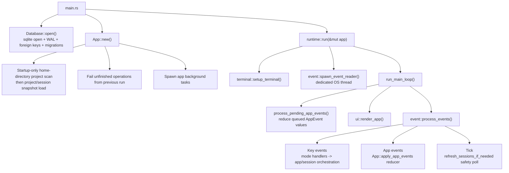
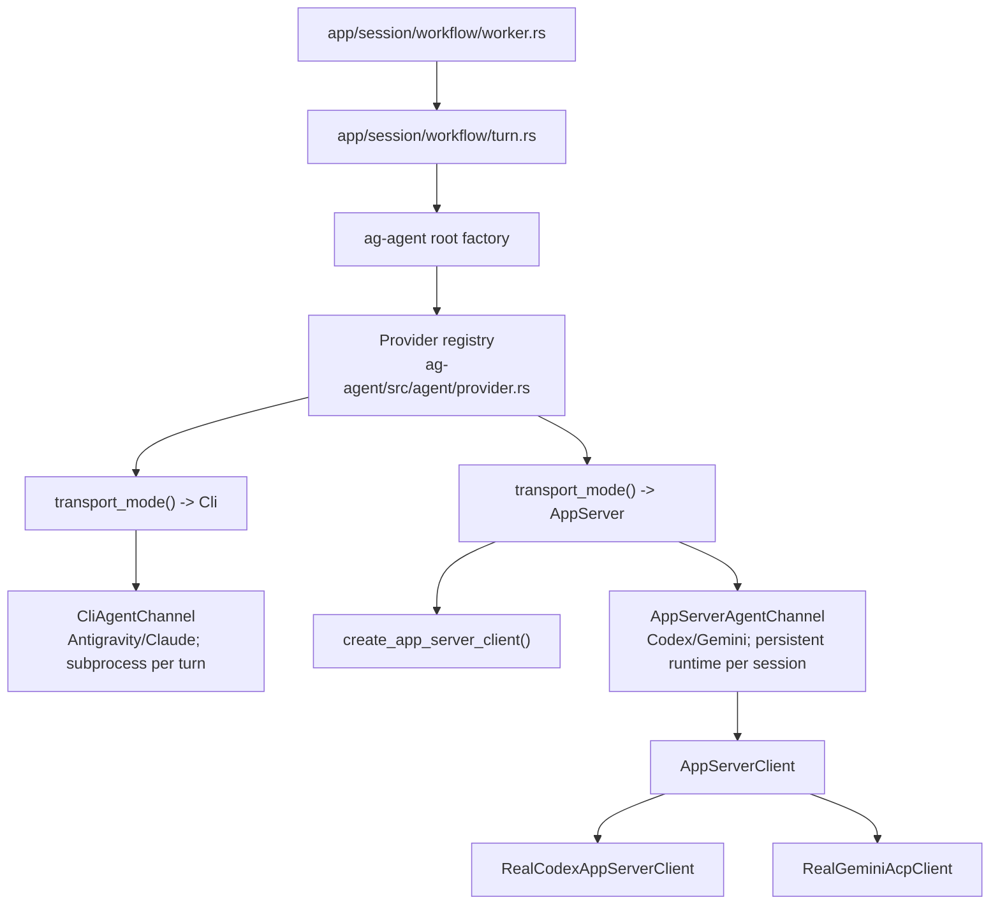

+++
title = "Runtime Flow"
description = "Goals, workspace map, runtime event flow, background tasks, and agent channel transport model."
weight = 2
+++

 This guide documents Agentty's
runtime data flows at a high level: the foreground event loop, reducer/event buses,
session-worker turn execution, merge/rebase/sync orchestration, and background tasks.
Implementation details live in the module docstrings; this page explains how the pieces
fit together.

<!-- more -->

## Architecture Goals

 Agentty runtime design is built around
these constraints:

- Keep domain logic independent from infrastructure and UI.
- Keep long-running or external operations behind trait boundaries for testability.
- Keep runtime event handling responsive by offloading background work to async tasks.
- Keep AI-session changes isolated in git worktrees and reviewable as diffs.
- Decouple agent transport (CLI subprocess vs app-server RPC) behind a unified channel
  abstraction.

## Workspace Map

| Path                      | Responsibility                                                       |
| ------------------------- | -------------------------------------------------------------------- |
| `crates/ag-forge/`        | Shared forge review-request library (`gh`/`glab` adapters).          |
| `crates/ag-git/`          | Shared git, worktree, sync, rebase, and merge library.               |
| `crates/ag-agent/`        | Shared agent provider models plus channel and transport boundaries.  |
| `crates/ag-protocol/`     | Shared structured response protocol and turn prompt payload library. |
| `crates/ag-tui-text/`     | Shared markdown, mermaid, wrapping, and truncation text helpers.     |
| `crates/agentty/`         | Main TUI application crate.                                          |
| `crates/testty/`          | TUI end-to-end testing framework.                                    |
| `crates/ag-xtask/`        | Workspace maintenance and automation commands.                       |
| `docs/site/content/docs/` | End-user and contributor documentation.                              |

## Main Runtime Flow

 Primary foreground path from process start
to one event-loop cycle:

 Foreground loop details:

- `run_main_loop()` drains one bounded batch of queued app events before draw so touched
  sessions sync from their live handles without a full list-wide sweep every frame.
- `run_main_loop()` owns `PresentationState`; input measurement and `ui::render_app()`
  share its bounded `RenderCacheStore`. `App` neither constructs Ratatui frames nor owns
  render caches.
- `process_events()` waits on terminal events, app events, or tick, then drains a
  bounded batch of queued terminal events to avoid one-key-per-frame lag.
- Tick interval is `50ms`; metadata-based session reload fallback is `5s`.

## Data Channels

 Agentty uses four primary runtime data
channels:

- **Terminal `Event` channel** (`runtime/event.rs`): the event-reader thread forwards
  `crossterm` events into `runtime::process_events()`.
- **App event bus** (`AppEvent`): background tasks and workers send typed events into
  the `App::apply_app_events()` reducer for safe cross-task state mutation.
- **Turn event stream** (`TurnEvent`): `AgentChannel` implementations stream transient
  loader-thought and PID updates to the session turn consumer while the final transcript
  waits for the completed turn result.
- **Session handles** (`SessionHandles`): shared `Arc<Mutex<...>>` transcript, status,
  PID, and queued-message state. Handles are the single source of truth for live session
  data; the reducer re-projects them into render snapshots on `SessionUpdated` without a
  full DB reload.

## App Event Reducer

 `App::apply_app_events()` is the
single reducer path for async app events. Each cycle drains queued events up to a
bounded budget, coalesces them into one `AppEventBatch` (refresh, git status, model, and
loader updates), and applies side effects in stable order. Key behaviors:

- Refresh events set reload flags instead of reloading inline; the expensive
  home-directory project discovery runs only during `App::new()`.
- Git-status and review-request events carry a sync-context generation so stale
  completions are discarded after the active project or session changes.
- Externally merged review requests transition sessions to `Done`; closed requests
  transition them to `Canceled`.
- Terminal statuses (`Done`, `Canceled`) drop per-session worker senders so workers can
  shut down their runtimes.

## Session Chat Rendering

 The session chat panel is rendered
by `crates/agentty/src/ui/page/session_chat.rs` and
`crates/agentty/src/ui/component/session_output.rs`. The durable transcript is the
ordered `session_message` rows (typed `UserPrompt`, `AssistantAnswer`, `WorkflowNotice`,
rows); the component layers synthetic content on top at render time: the
`session.summary` block, focused review text, the in-progress published-branch sync row,
and the animated loader row. Completed published-branch auto-push results are persisted
as `WorkflowNotice` transcript rows instead of synthetic render rows. Structured
clarification questions render in the bottom question panel (`AppMode::Question`), not
inside the output component.

`App` owns one shared `RenderCacheStore` for markdown, diff, and session-output layout
caches. Changes in this area should keep caches bounded and route layout/count helpers
and the final paint path through the same cached derived data instead of recomputing the
render twice per frame.

## Session Turn Data Flow

 From prompt submit to persisted result:

1. Prompt mode converts a submit key into an app-layer prompt intent;
   `App::handle_prompt_submit_intent()` drains normal submissions or dispatches
   slash-command selections.
1. `start_session()` (first prompt) or `reply()` (follow-up) persists the command in
   `session_operation` and enqueues it on the per-session worker.
1. The worker marks the operation `running`, checks cancel flags, verifies worktree
   isolation, and delegates to `workflow/turn.rs` or the queued session-sync workflow.
1. `workflow/turn.rs` builds a `TurnRequest` and calls `AgentChannel::run_turn()`, which
   streams `TurnEvent` values (loader updates) and returns a `TurnResult`.
1. `workflow/post_turn.rs` appends the final assistant transcript output, then
   `TurnPersistence::apply(...)` transactionally stores the summary payload, question
   payload, token-usage deltas, and provider conversation markers.
1. `AppEvent::AgentResponseReceived` carries the reducer projection so the active
   session updates without a forced reload. If persistence fails, the worker appends a
   recovery error and falls back to a durable-state reload.
1. Auto-commit keeps one evolving commit on the session branch: the first file-changing
   turn creates it, later turns regenerate the message from the cumulative diff with the
   project's `Default Fast Model` and amend `HEAD`; an empty amend drops the reverted
   commit. The session title is synced from the commit text.
1. If the session already tracks a published upstream branch and no chat message or sync
   operation is queued, a per-session branch-operation guard transfers to the detached
   auto-push until it finishes. Every sync request holds the same guard through status
   transition and operation persistence, so its rebase is observed before publish starts
   or waits until the active publish completes. Post-rebase auto-push transfers the
   guard again, preventing a subsequent sync from starting until that publish finishes.
   After a successful push, linked review-request and commit metadata are resolved and
   refreshed; lookup failures append the existing warning notice instead of being
   discarded. The push result is appended as a durable transcript notice.
1. Completed stacked-parent turns fan out `SessionCommand::Rebase` to review-ready
   materialized children so child branches replay onto the latest parent branch.
1. The session size is refreshed and the final status becomes `Review` or `Question`
   (failures return to `Review`).

### Operation Lifecycle and Recovery

 Turn execution is durable and
restart-safe:

- Before enqueue: insert `session_operation` row (`queued`).
- Worker transitions: `queued -> running -> done/failed/canceled`.
- If a completed turn cannot persist its terminal status, the worker leaves the
  operation `running` instead of marking it failed, so startup recovery can reset the
  session to `Review` rather than overlooking a persistent `InProgress` session. That
  worker stops dispatching later messages until recovery so it cannot execute more work
  from the inconsistent status.
- Cancel requests are persisted and checked before command execution.
- On startup, unfinished operations are failed with reason `Interrupted by app restart`,
  interrupted rebase operations abort stale in-progress git rebase metadata, and
  impacted sessions are reset to `Review`. Pending post-merge stacked-child syncs are
  requeued.
- Prompts queued behind an active turn send ordered drain wake-ups to the same worker.
  If transcript persistence fails, the prompt returns to the front of the queue and the
  next pending wake-up retries it before later prompts, preserving FIFO order without a
  polling loop.

### Status Transition Rules

 Runtime status transitions enforced by
`Status::can_transition_to()` or explicit cancellation paths:

- `Draft -> InProgress` (first prompt)
- Draft session in `Draft` status -> `Canceled` (list-mode cancel before first turn)
- `Review/Question -> InProgress` (reply)
- Root `Review/AgentReview -> Review` (forked session snapshot opens as a new
  review-ready session)
- `Review -> Queued -> Merging -> Done` (merge queue path)
- `Review/AgentReview -> Rebasing -> Review/Question` (session sync path; starting from
  `AgentReview` cancels pending focused-review output)
- `InProgress -> Rebasing -> Review/Question` (session sync requested during a running
  turn is queued on the session worker and starts after the active turn)
- `Review/Question -> Canceled`
- `InProgress -> Review` (user stops the current turn)
- `InProgress -> Canceled` (list-mode cancel stops the running turn)
- `InProgress/Rebasing -> Review/Question` (post-turn or post-sync)

Stacked-session gates are enforced before branch work starts: a stacked draft
materializes only when its parent is review-ready and no stack member is busy; parent
merge-queue and slash-command branch work are blocked while a materialized child remains
linked; parent sync and replies are allowed when materialized children are idle. All
checks are computed from one stack snapshot so parent, child, and sibling decisions
share the same busy state.

## Agent Channel Architecture

 Session workers are transport-agnostic through
`AgentChannel`:

 Key types
(`crates/ag-agent/src/channel/contract.rs`, re-exported by the `ag-agent` crate root,
with prompt payloads owned by `ag-protocol` and re-exported through
`domain/turn_prompt.rs`):

| Type               | Purpose                                                                                                                                                               |
| ------------------ | --------------------------------------------------------------------------------------------------------------------------------------------------------------------- |
| `TurnRequest`      | Input payload: `reasoning_level`, folder, `live_transcript`, `main_checkout_root`, optional `replay_transcript`, model, `request_kind`, prompt, and provider context. |
| `TurnEvent`        | Incremental stream events: `ThoughtDelta`, `Completed`, `Failed`, `PidUpdate`.                                                                                        |
| `TurnResult`       | Normalized output: `assistant_message`, token counts, `provider_conversation_id`.                                                                                     |
| `AgentRequestKind` | `SessionStart`, `SessionResume`, or `UtilityPrompt`; replay text lives on `TurnRequest` rather than the request kind.                                                 |

 App-server providers return a
`provider_conversation_id` in `TurnResult`. Post-turn application persists it, along
with an instruction-bootstrap marker, so later turns and runtime restarts can resume the
native provider context and choose between resending the full prompt contract and a
compact reminder.

 Session isolation guards:

- Before every worker-dispatched turn, `workflow/isolation.rs` verifies the session
  folder exists, is checked out on the expected `wt/<hash>` branch, and resolves to a
  linked worktree with a distinct main checkout.
- The worker snapshots the main checkout's tracked-file git status before each turn and
  inspects that status again after the turn. It appends a `[Main Checkout Warning]`
  transcript notice only when the status changed and remains dirty, so clean `HEAD`
  movement from parallel session merges and unchanged pre-existing dirt do not add
  transcript noise.
- Merge and `sync main` workflows require a clean target checkout before changing
  base-branch state.
- Provider permission policies are scoped per transport: Codex turns run with a
  non-interactive approval policy and workspace-write sandbox. Agentty immediately
  declines MCP elicitations and grants no additional permission requests so an
  app-server request cannot leave the turn waiting for interactive input. Codex tool
  input requests receive an empty answer set for the same reason. Claude turns receive
  session-scoped settings that deny writes to the known main checkout, Gemini ACP
  requests prefer one-shot allow options, and CLI-backed providers run from the session
  worktree process directory.

## Agent Interaction Protocol Flow

 Provider output is normalized to
one structured response protocol (`answer`, `questions`, optional `summary`):

1. Prompt builders in `crates/ag-agent/src/agent/` ask `crates/ag-protocol/src/` to
   prepend the shared protocol preamble with a self-descriptive JSON schema. CLI turns
   resend it every turn; persistent app-server turns reuse a compact reminder when the
   provider context already received the full bootstrap, and replay the transcript when
   provider context was lost. Transcript replay frames the new prompt as a follow-up in
   the whole-session context, so rollback wording applies to changes made during the
   Agentty session unless the user explicitly says otherwise. `crates/ag-protocol/src/`
   owns the shared response model, schema, parser diagnostics, protocol prompt
   envelopes, repair prompts, and turn prompt payloads.
1. Channels emit transient loader updates as `TurnEvent::ThoughtDelta` values while the
   turn runs; assistant transcript output is appended once from the final parsed result.
1. Final output must parse as the shared protocol JSON object. Claude, Gemini, and Codex
   session turns fail closed on invalid output; Antigravity tries one protocol-repair
   retry and then preserves non-empty plain text as `answer`. Rejected payloads surface
   parse diagnostics (response sizing, parser location, visible top-level keys).
1. Provider-specific transport, stdin-vs-argv prompt delivery, strict parsing policy,
   and thought-phase handling are centralized in the provider registry
   (`crates/ag-agent/src/agent/provider.rs`).

## Clarification Question Loop

 Question-mode loop:

1. The worker receives a final parsed response containing clarification `questions`,
   persists them, and sets session status `Question`.
1. The reducer switches the active view to `AppMode::Question` when that session is
   focused.
1. The user answers each question (a blank free-text answer stores `no answer`).
1. Runtime builds one `Clarifications:` follow-up prompt listing each question and
   answer, and submits it as a normal reply turn.

Pressing `Ctrl+C` instead ends question mode immediately, restores the session to
`Review`, and does not send the generated clarification reply.

## Background Task Catalog

 Background execution paths and
their triggers:

- **Terminal event reader thread** (runtime startup): polls crossterm and forwards
  terminal events into the runtime loop.
- **Project sync orchestrator** (startup, project switch, ticks, list-mode `s`): owns
  one command queue per active project that serializes read-only `git fetch`,
  ahead/behind snapshots, review-request refreshes, and manual pull/rebase/push
  commands.
- **Version check** (startup): reports npm update availability.
- **Per-session worker loop** (first command enqueue): serializes all turn commands per
  session and manages channel lifecycle.
- **Per-turn event consumer** (every turn): consumes the `TurnEvent` stream and
  coalesces loader updates.
- **CLI stdout/stderr readers** (every CLI-backed turn): stream subprocess output into
  loader updates and final buffers.
- **App-server stream bridge** (every app-server turn): bridges provider stream events
  into the unified turn event stream.
- **Clipboard image persistence** (prompt image paste): reads a copied PNG file,
  clipboard image, or PNG path from `ag-clipboard` via `spawn_blocking`, stores it under
  `AGENTTY_ROOT/tmp/<session-id>/images/`, and inserts an inline `[Image #n]`
  placeholder. The backend supports macOS pasteboard, X11 reads, and Wayland reads via
  `wl-paste`; missing or unsupported backends report an inline paste error.
- **Session title generation** (first start turn): runs a one-shot title prompt and
  persists a concise generated title.
- **At-mention file indexing** (`@` in prompt or question input): lists session files
  for the mention picker, falling back to the project root for unstarted drafts.
- **Session-size refresh** (`Enter` on a session in list mode): recomputes the diff-size
  bucket off the key-handling path.
- **Branch-publish action** (session view `p`): pushes with `--force-with-lease` and
  creates or refreshes the forge review request.
- **Deferred session cleanup** (session delete): removes the worktree folder and branch
  after database deletion.
- **Session fork** (root session view `F`): creates a new worktree branch from the
  source session branch, copies `session_message` rows in one transaction, clears
  provider/review-request/stack linkage, and marks the fork for one-time transcript
  replay before its first reply. Stacked child sessions do not expose this action.
- **Focused review assist** (entering review): runs the review prompt with the diff and
  saved user/agent chat history, then stores the result or error.
- **Sync-main workflow** (list-mode `s`): pull/rebase/push of the project branch through
  the sync orchestrator, with assisted conflict resolution.
- **Session merge task** (merge confirmation): rebase, squash merge with the session
  commit message, worktree cleanup.
- **Session sync task** (view-mode `r`, stacked-parent fan-out): assisted rebase of the
  session branch; post-merge stacked-child syncs use `git rebase --onto` with the
  recorded parent commit as the old base.

## Sync, Merge, and Rebase Flows

 Project and session git workflows
use shared boundaries (`GitClient`, `FsClient`, assist helpers) with distinct
orchestration paths:

- `sync main`: selected project branch pull/rebase/push with optional assisted conflict
  resolution, serialized through the shared sync orchestrator.
- Session merge: queue-aware workflow — assisted rebase first, squash commit into the
  base branch reusing the session-branch `HEAD` commit message, then worktree cleanup
  and status `Done`.
- Session sync: assisted rebase onto the local base branch (unpublished) or the
  published upstream's remote base ref (published). Rebase-conflict prompts run through
  the existing session channel so the provider keeps conversation context while Agentty
  owns staging and `git rebase --continue`.
- Review-request publish: push with `--force-with-lease`, then create or refresh the
  forge review request through `ReviewRequestClient`; only open same-branch requests are
  reused.
- Background review-request sync: review-ready sessions with a published branch or
  linked request are polled; merged requests move the session to `Done`, closed requests
  to `Canceled`. The Inbox tab loads comment snapshots on demand with generation-scoped
  deduplication.
- Assigned-issue refresh: the Issues tab resolves the active project remote and runs a
  repository-scoped, generation-scoped `gh search issues` task through
  `ReviewRequestClient`; stale completions are discarded before the list-only cache is
  rendered.

## Persistence and Recovery Boundaries

 Persistence invariants that shape
runtime flow:

- DB opens with SQLite WAL and `foreign_keys = ON`, then embedded migrations run at
  startup.
- Session snapshots in memory are authoritative for rendering; DB is authoritative for
  restart recovery.
- Durable session mutations commit before shared handles change or `SessionUpdated` is
  emitted. Failed status or transcript writes therefore leave the render snapshot and
  reducer event stream unchanged.
- Status transitions use the validated current status as a SQLite compare-and-swap
  condition, so concurrent stale transitions cannot both commit. The initial prompt,
  title, user transcript row, runnable status/timing, draft flag, and queued operation
  commit together before the first-turn snapshot is published or dispatched.
- Status and active-work timing, transcript messages and ordering metadata, and
  completed-turn metadata each commit through transaction-scoped repository methods;
  app-layer callers receive persistence errors instead of publishing best-effort
  snapshots.
- System logs are process-local only: a bounded in-memory buffer, never written to
  SQLite or disk.
- Shared session handles provide low-latency updates between DB reloads.
- Event-driven refresh is primary; metadata polling is fallback safety only.
- External integrations (`GitClient`, `ReviewRequestClient`, `AppServerClient`,
  `AgentChannel`, `EventSource`, `FsClient`, `TmuxClient`) isolate side effects and
  enable deterministic tests.
