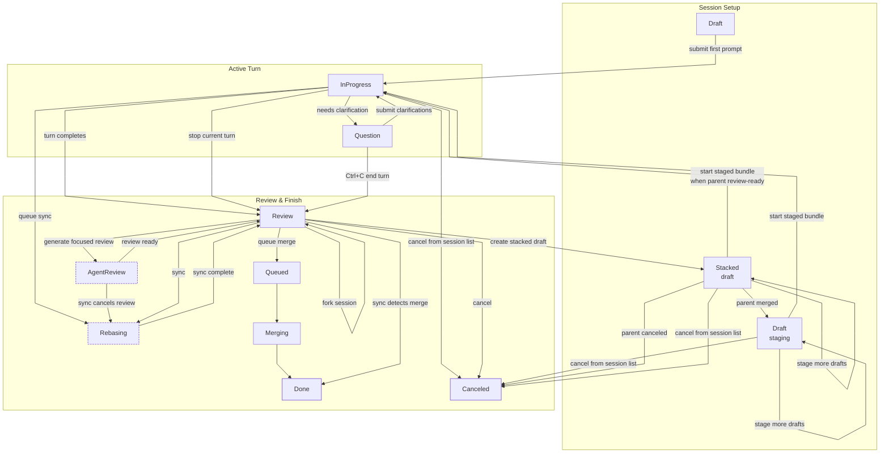

+++
title = "Workflow"
description = "Interface layout, session lifecycle, slash commands, and data location."
weight = 1
+++

<a id="usage-workflow-introduction"></a> This page covers the Agentty interface layout,
session lifecycle, session sizes, slash commands, and data location.

For keyboard shortcuts by view, see [Keybindings](@/docs/usage/keybindings.md).

<!-- more -->

## Interface Layout

<a id="usage-interface-layout"></a> Agentty organizes its interface into six primary
tabs. Press `Tab` to move forward or `Shift+Tab` to move backward:

- **Projects**: Select between projects (git repositories) in a dashboard view with an
  activity heatmap, work-pace metrics, token usage, and a project table showing names,
  branches, session counts, last-opened dates, and paths. Detected agent CLIs and their
  versions are listed here too.
- **Sessions**: List, create, and manage agent sessions for the active project. Rows
  show a size marker prefix (for example `[XL]`), the current `agent/model` with its
  reasoning level, and a live active-work `Timer` column. The list shows only populated
  merge queue, active, and archive groups. When there are no sessions, it prompts you to
  press `a` to start one.
- **Inbox**: Read-only list of open GitHub pull requests or GitLab merge requests that
  request your review in the active project, including drafts. Press `s` to refresh and
  `Enter` to open a read-only detail page with the description and comment threads.
- **Issues**: List-only view of open GitHub issues assigned to the user authenticated
  with `gh` in the active project repository. Press `s` to refresh and use `j` / `k` to
  move through the first `100` results; issue details are not available in this
  iteration. Install the GitHub CLI and run `gh auth login` to enable this tab.
- **Settings**: Configure the color theme, default reasoning level, smart/fast/review
  model defaults, the optional `Last used model as default` mode, the session commit
  coauthor trailer, and `Launch Configurations` for the active project.
- **Logs**: Inspect process-local system log events. Logs are not persisted; Agentty
  keeps the newest `1000` entries in memory.

On startup, Agentty restores the last active list tab. If no tab has been saved yet but
an active project is already persisted, Agentty opens on **Sessions** so you can resume
project work without first selecting the project again.

In session chat view, the status-colored session title renders in a header row above the
output panel, with a metadata row showing the size bucket, `+added` / `-deleted` line
totals, the cumulative active-work timer, the current model, the effective reasoning
level, and token usage. A linked pull-request or merge-request URL appears in the header
when present. The timer ticks only while the session is actively working. Each session
stores the project reasoning default when it is created, so later default changes affect
new sessions without relabeling existing ones.

The top status bar shows the current version and update status, and rotates short
page-scoped `FYI:` messages once per minute in the **Sessions** list and session chat
view.

The footer shows the active directory and branch. When the current branch tracks an
upstream, the branch badge renders `local -> remote`. Inside a session, the footer
switches to the session directory and shows the session branch's ahead/behind counts
relative to its base branch, plus a second segment for the published remote branch when
one exists.

New session worktrees start from the local active base branch. If local `main` is behind
`origin/main`, the session branch still starts from local `main`; run list-mode sync
(`s`) first when you want a new session to include remote-only commits.

If list-mode sync stops on rebase conflicts, the sync popup stays in its loading state
and changes to a conflict-resolution message listing the conflicted files being handed
to the assist agent.

## Session Lifecycle

<a id="usage-session-lifecycle"></a> Session statuses:

| Status          | Meaning                                                          |
| --------------- | ---------------------------------------------------------------- |
| **Draft**       | Created but not started; draft sessions can stage prompts first. |
| **InProgress**  | Agent is working; `r` queues sync behind the running turn.       |
| **Review**      | Agent finished; changes are ready for review.                    |
| **AgentReview** | Focused review is generating; `r` cancels it before syncing.     |
| **Question**    | Agent requested clarification before continuing.                 |
| **Queued**      | Waiting in the merge queue.                                      |
| **Rebasing**    | Session branch is rebasing onto its base branch.                 |
| **Merging**     | Changes are being merged into the base branch.                   |
| **Done**        | Completed and merged; the worktree was removed.                  |
| **Canceled**    | Canceled by the user; the worktree was removed.                  |

The shortcuts available in each state are listed in
[Keybindings](@/docs/usage/keybindings.md).

When a session enters **Review**, Agentty starts focused review in the background. While
it is running, **AgentReview** keeps the review-oriented shortcuts available; pressing
`r` starts session sync immediately and cancels pending focused-review output so stale
review text cannot reappear after the rebase begins.

### Typical Transitions



### Active Turns and the Message Queue

While a session is **InProgress**, an animated loader row shows transient provider
thought and tool-status text; the transcript itself updates only after the final turn
result is parsed and persisted.

Turn summaries, focused reviews, and workflow results are durable timeline entries. A
background operation first shows one pending row, then updates that row in place when it
succeeds or fails. Starting another turn does not remove earlier summaries or reviews;
they remain directly after the turn that produced them.

Pressing `Enter` during a running turn opens the composer and queues the message inline
with a `queued ›` prefix. Queued messages dispatch one-by-one as new turns after the
running turn finishes. Each `Ctrl+c` press retracts the most recently queued message
(LIFO) without interrupting the running turn; once the queue is empty, the next `Ctrl+c`
stops the current turn and returns the session to **Review**. The queue is in-memory
only and is discarded if `agentty` restarts.

Pressing `r` during a running turn queues session sync on the same session worker. The
session stays **InProgress** while the active turn runs, then moves to **Rebasing** when
the queued sync command starts. Agentty shows a `[Sync]` notice in the session output
while the rebase is queued, and repeated `r` presses keep the single queued rebase
instead of adding duplicates. Session sync reserves branch-publish ownership before it
queues or starts, and retains that ownership through its post-rebase push. A completed
turn or subsequent sync therefore cannot start a competing published-branch auto-push.

### Focused Review

When a session enters **Review**, Agentty starts generating a focused review in the
background and temporarily shows **AgentReview**. Its pending row is replaced by the
completed review or a visible failure in the same timeline position. Press `f` to start
or regenerate review for the current diff. Completed review entries stay visible across
diff mode, question mode, later prompts, and restarts. Focused review includes the saved
user and agent chat history for context. It uses inspection-only context: it may read
files, search, inspect git history, and browse when needed, but it recommends
verification commands instead of running checks itself. `Project Impact` renders as
concise bullets, and `Suggestions` renders as bullets formatted
`[Severity]: Issue details`, using `[High]` or `[Medium]` when follow-up work is needed.
A turn stopped with `Ctrl+c` does not start a focused review automatically; press `f`
for a manual one.

### Session Output Markdown

Session output renders common Markdown blocks in agent answers and persisted user
messages, including headings, lists, block quotes, code fences, and pipe tables. Tables
are aligned to the output panel width so compact comparison data stays readable in the
terminal transcript. Leading horizontal whitespace in pasted prompts is preserved after
submission, including nested indentation in multiline text. Tabs render at four-column
tab stops.

<a id="usage-session-mermaid"></a> Complete ```` ```mermaid ```` fenced blocks in
session output render as Unicode diagrams. Simple `graph`/`flowchart` diagrams with
`TD`, `TB`, or `LR` direction are supported, including edges that span multiple layers
and compact two-node `LR` feedback loops. Solid, dotted, and thick edges render with
optional labels in the `-->|label|`, `-- label -->`, `-.label.->`, and `==label==>`
forms. Long or HTML line-break edge labels degrade to the first renderable label line
instead of preventing the graph preview. `erDiagram` entity-relationship diagrams render
entities as boxes, relationships as lines labeled with the relationship name, and
crow's-foot cardinalities as compact end markers — `1` (exactly one), `?` (zero or one),
`*` (zero or more), and `+` (one or more). Entity attribute blocks are omitted from the
diagram. Simple `sequenceDiagram` participant and message lines render as lifelines with
arrowed message rows; self-messages render as a compact loop on their lifeline, and
participant or message labels longer than the 32-character label limit are truncated
with a trailing ellipsis instead of preventing the diagram preview. Unsupported diagram
types, incomplete blocks, and diagrams wider than the panel keep the plain fenced-code
presentation. Session turn prompts tell agents about this supported diagram subset, so
agents include a diagram when it explains a flow, process, or relationship better than
prose. The prompts also instruct agents to place Mermaid only in the assistant `answer`
as an unindented ```` ```mermaid ```` fenced block, because plain code fences or
indented blocks stay in the fenced-code presentation.

### Forking a Review Session

Pressing `F` in a root **Review** or **AgentReview** session opens a confirmation, then
creates a new independent **Review** session from the source session branch. The fork
receives a fresh worktree branch and a copy of the durable transcript history as it
existed at fork time. Stacked child sessions hide `F` because their branch remains tied
to the parent stack workflow. Provider-native conversation IDs, focused-review cache,
published branch state, linked review-request metadata, stack parent links, active-work
timing, and token usage are reset on the fork so future replies and publishing are
tracked separately from the source session. Historical timeline entries, including
completed summaries and focused reviews, remain part of the copied transcript.

### Commit and Merge Behavior

After each successful turn with file changes, Agentty keeps the session branch at one
evolving commit: it regenerates the commit message from the cumulative session diff
using the project's `Default Fast Model`, applies the `Coauthored by Agentty` setting,
amends `HEAD`, and refreshes the session title from the commit text. If a later turn
reverts every change, the empty session commit is dropped. Commit, merge, sync, and
published-branch push results are persisted in the session timeline.

When a session merges, Agentty reuses the session branch `HEAD` commit message for the
final squash commit on the base branch. Merging requires a clean main checkout and
returns the session to **Review** if the preparatory rebase or squash-merge fails.

When a session syncs (`r`), Agentty rebases the session branch: published sessions fetch
first and rebase onto the remote base ref, unpublished sessions rebase onto the stored
local base branch. In **InProgress**, the sync request is queued behind the running turn
before the session enters **Rebasing**. If the rebase stops on conflicts, Agentty asks
the existing agent session to resolve only the conflicted files, then stages the edits
and continues the rebase itself.

During normal turns, the agent prompt names the session worktree as the only writable
root. After a turn, if Agentty detects that the main checkout's tracked-file status
changed and remains dirty, it appends a `[Main Checkout Warning]` notice to the
transcript. Clean `HEAD` movement, such as another session landing on the base branch,
and unchanged pre-existing tracked changes do not emit this warning.

### Continuing a Done Session

Pressing `c` on a **Done** session opens a confirmation, then creates a brand-new draft
session with a continuation message staged from the merged commit hash (or the saved
summary when the hash is unavailable). **Canceled** sessions remain terminal and
read-only.

## Draft and Stacked Sessions

<a id="usage-draft-stacked"></a> From the **Sessions** tab, press `a` to choose between
`Regular`, `Draft`, and `Stacked` session creation:

- `Regular` starts the agent immediately on the first `Enter`.
- `Draft` stages each `Enter` as one ordered draft message and starts only after you
  press `s`. The worktree is created at that start step, so the branch is based on the
  base branch at launch time. From a draft session view, `Ctrl+V`, `Ctrl+Shift+V`, or
  `Alt+V` opens the draft composer and pastes one clipboard image into the next staged
  draft.
- `Stacked` creates a draft below the selected parent session, with its future branch
  based on the parent session branch. Only one stacking level is available.

Stacked drafts show `s` start only when the parent is in **Review** or **AgentReview**
and no stack member is running, queued, syncing, merging, or waiting on a question.
While a materialized child is linked, the parent keeps `Enter` replies, `m` merge
queueing, and `r` sync but hides slash commands. Syncing the parent (or completing a
parent turn) rebases review-ready children onto the refreshed parent branch
automatically. When the parent merges, children are retargeted onto the parent's base
branch and review-ready children are synced with `git rebase --onto` so they keep only
their own commits. When the parent is canceled, its stacked child is canceled too.

## Branch Publish Flow

<a id="usage-review-request-flow"></a> In **Review** and **AgentReview**, `p` opens a
publish popup for the linked forge review request:

- Leave the field empty to keep the default branch target, or type a custom remote
  branch name. After the first publish, the popup is locked to that same remote branch.
- Agentty publishes with `git push --force-with-lease`, then creates or refreshes the
  linked review request and shows the resulting URL. GitHub projects publish pull
  requests; GitLab projects publish merge requests.
- Stacked child review requests target the parent review branch while the parent link is
  active.
- When no review request is linked yet, only an open request for the same branch is
  reused; merged or closed requests are left alone.
- After the first publish, later completed turns push the same remote branch
  automatically in the background when no chat message or sync is already queued, and
  update the review request title and description from the latest session commit message
  when they differ. Failed background pushes keep the manual `p` flow available for
  retry.

<a id="usage-review-request-prerequisites"></a> Publishing needs regular Git
authentication (credential helper or PAT for HTTPS remotes, SSH key for SSH remotes)
plus the forge CLI for the repository remote: authenticated `gh` for GitHub and
authenticated `glab` for GitLab. See
[Forge Authentication](@/docs/usage/forge-authentication.md) for setup steps.

## Review Request Sync

<a id="usage-review-request-sync"></a> After a branch has been published, Agentty
refreshes review-request status in the background for **Review** and **AgentReview**
sessions. The session list shows forge indicators next to the status label:

| Indicator | Meaning                                 |
| --------- | --------------------------------------- |
| `↑`       | Branch published; no request found yet. |
| `⊙ <id>`  | Review request `<id>` is open.          |
| `✓ <id>`  | Review request `<id>` was merged.       |
| `✗ <id>`  | Review request `<id>` was closed.       |

When a sync detects that the review request was merged, the session moves straight to
**Done**; a closed request moves it to **Canceled**.

<a id="usage-review-comments-preview"></a> In **Review** or **AgentReview**, press `d`
to open the diff page. Cached pull-request or merge-request line comments render below
matching diff lines, and `c` toggles the right panel between the annotated diff and a
comments overview grouped by file. Resolved threads are hidden. The panel is read-only —
replies happen on the forge web UI.

## Clarification Interaction Loop

<a id="usage-clarification-loop"></a> If an agent emits structured clarification
questions, the session moves to **Question** status. You answer each question in
sequence, and Agentty sends one consolidated follow-up message back to the session.

<a id="usage-question-options"></a> Questions may include predefined answer options
shown as a numbered list; use `j`/`k` or `Up`/`Down` to navigate and `Enter` to submit
the highlighted choice. Moving past the list edges switches to the free-text input.
Submitting a blank free-text answer stores `no answer`. `Ctrl+C` ends the clarification
turn and returns the session to **Review** without sending a reply, while `q` (outside
free-text input) returns to the sessions list with the **Question** state kept for
later; answers already submitted are saved, and reopening the session resumes at the
next unanswered question.

## Prompt Input Extras

<a id="usage-prompt-extras"></a> In prompt input, `Ctrl+V`, `Ctrl+Shift+V`, and `Alt+V`
paste one clipboard image into the current draft or reply as an inline `[Image #n]`
token; from a draft session view, the same shortcuts first open the composer and then
paste the image. The referenced local images are sent to the agent with the prompt. The
clipboard source can be a copied PNG file, raw image data, or PNG path text from the
host clipboard backend. Wayland reads use `wl-paste` when it is available; missing or
unsupported clipboard backends report an inline paste error. Draft image files are
removed when the composer is canceled, after a submitted turn finishes, and when a
session is deleted or canceled.

`@` file lookups keep the raw `@path/to/file` text visible in the composer and
transcript; the agent-facing prompt rewrites them to quoted `path/to/file` tokens.

If an agent command exits with an error, Agentty prints a short failure header followed
by captured `stdout` and `stderr` sections, with JSONL provider events summarized into
readable lines.

## Session Sizes

<a id="usage-session-size"></a> Agentty classifies sessions by the number of changed
lines in their diff:

| Size    | Changed Lines |
| ------- | ------------- |
| **XS**  | 0-10          |
| **S**   | 11-30         |
| **M**   | 31-80         |
| **L**   | 81-200        |
| **XL**  | 201-500       |
| **XXL** | 501+          |

Session size is recalculated after each completed agent turn, persisted to the session
record, and rendered as a title prefix in the **Sessions** list.

## Slash Commands

<a id="usage-slash-commands"></a> Type these in the prompt input to access special
actions. From an editable session view, press `/` to open the composer with the leading
slash already inserted:

The command picker filters as you type and accepts contains or fuzzy abbreviations such
as `/o` for `/model`.

| Command      | Description                                                   |
| ------------ | ------------------------------------------------------------- |
| `/apply`     | Verify focused-review suggestions, then apply the valid ones. |
| `/model`     | Switch the model for the current session.                     |
| `/reasoning` | Override the reasoning level for the current session.         |

`/apply` requires a completed focused review (`f` key). `/model` and `/reasoning` only
offer locally available backends; see [Agents & Models](@/docs/agents/backends.md).

<a id="usage-title-refinement"></a> When the first prompt is submitted, Agentty stores
it as the initial title and generates a refined title in the background using the
project's `Default Fast Model`. Draft sessions regenerate the title as more drafts are
staged.

## Settings Scope

<a id="usage-settings-scope"></a> Settings for models, reasoning, commit trailers, and
launch configurations are stored per active project; the `Theme` setting is global. The
Settings tab renders these scopes as `Global settings` and `'<project>' settings`. Rows
with fixed choices open dropdowns; use `j` / `k` to move through options and `Enter` to
save the highlighted value.

The `Launch Configurations` row opens a command-list editor instead of a multiline text
field. Use `a` to add an entry, `e` or `Enter` to edit the selected entry, `d` to delete
it, and `J` / `K` to reorder entries. Add/edit mode uses a single-line input; `Enter`
saves the command, and `Esc` cancels the input. Agentty trims commands and drops empty
entries when saving. When multiple `Launch Configurations` entries are configured,
pressing `o` in a session opens a selector popup.

## Auto-Update

<a id="usage-auto-update"></a> When Agentty launches, it checks npmjs for a newer
version in the background. If a newer version is detected, it automatically runs
`npm i -g agentty@latest` without blocking the UI:

- **Updating to vX.Y.Z...**: The background npm install is running.
- **Updated to vX.Y.Z — restart to use new version**: Installation succeeded; relaunch
  Agentty to use it.
- **vX.Y.Z version available update with npm i -g agentty@latest**: Automatic
  installation failed; run the displayed command manually.

To disable automatic updates, launch with `--no-update`:

```bash
agentty --no-update
```

When `--no-update` is set, Agentty still checks for newer versions and shows the manual
update hint, but does not install automatically.

Run `agentty --help` to list supported launch options or `agentty --version` to print
the installed Agentty version. Unsupported arguments produce an error instead of
launching the TUI.

## Data Location

<a id="usage-data-location"></a> Agentty stores its data in `~/.agentty/` by default.
This includes the SQLite database, session logs, and worktree checkouts (under
`~/.agentty/wt/`).

Per-session worktree folders are removed automatically after a session reaches `Done` or
`Canceled`, and when a session record is deleted.

You can override this location by setting the `AGENTTY_ROOT` environment variable:

```bash
# Run agentty with a custom root directory
AGENTTY_ROOT=/tmp/agentty-test agentty
```
